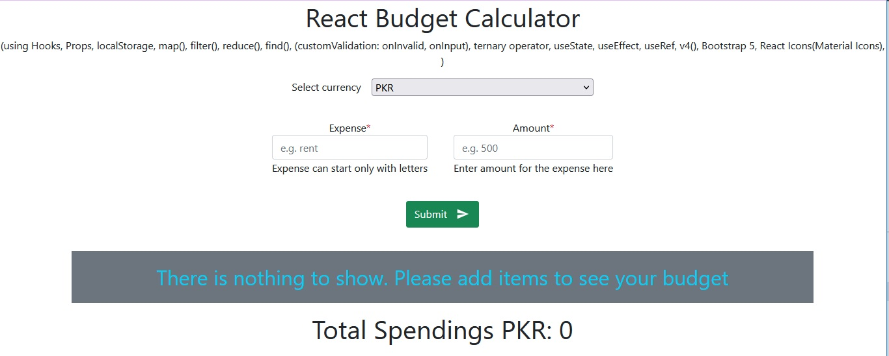

# README

  <h3><b>React Budget Calculator</b></h3>

  </img>

<!-- TABLE OF CONTENTS -->

# 📗 Table of Contents

- [📖 About the Project](#about-project)
  - [🛠 Built With](#built-with)
    - [Tech Stack](#tech-stack)
    - [Key Features](#key-features)
  - [🚀 Live Demo](#live-demo)
- [💻 Getting Started](#getting-started)
  - [Setup](#setup)
  - [Prerequisites](#prerequisites)
  - [Install](#install)
  - [Usage](#usage)
  - [Run tests](#run-tests)
  - [Deployment](#triangular_flag_on_post-deployment)
- [👥 Authors](#authors)
- [🔭 Future Features](#future-features)
- [🤝 Contributing](#contributing)
- [⭐️ Show your support](#support)
- [🙏 Acknowledgements](#acknowledgements)
- [❓ FAQ](#faq)
- [📝 License](#license)

<!-- PROJECT DESCRIPTION -->

# 📖 [Math Magicians] 

**[Budget Calculator]** It is a CRUD application created in React.

## 🛠 Built With 

<ol>
  <li>
    <ol>React
        <li>React Hooks: useState(), useEffect(), useReff()</li>
        <li>React Functions: map(), filter(), reduce(), find()</li>
    </ol>
  </li>
  <li>bootstrap</li>
  <li>React Material Icons</li>
  <li>LocalStorage</li>
</ol>

### Tech Stack 

Budget Calculator is a web-app where you can Add, Update, Delete and Clear All the items you added. It also gives you facility to change currency as per your need. It shows you the total automatically at the bottom. For storing the items program is using localstorage.

  
Client

  <ul>
    <li><a href="https://reactjs.org/">React.js</a></li>
  </ul>

  
Server

  <ul>
    <li><a href="https://expressjs.com/">Express.js</a></li>
  </ul>

Database

  <ul>
    <li><a href="https://www.postgresql.org/">PostgreSQL</a></li>
  </ul>

<!-- Features -->

### Key Features 

> You can.

- **[perform add your budget items]**
- **[you can update your budget items]**
- **[you can delete your budget items]**
- **[you can delete all your budget items at once]**
- **[you can change the currency as well]**
- **[It with add all your items amount and show you total at the bottom]**

(<a href="#readme-top">back to top</a>)

<!-- GETTING STARTED -->

## 💻 Getting Started 

To get a local copy up and running, follow these steps.

### Prerequisites

In order to run this project you need: 
`A text editor like VS Code`  
`and A web browser like chrome`

### Setup

Clone this repository to your desired folder:  
to clone write this command in terminal `git clone https://github.com/DilsherB/react-budget-calculator.git`  
then `cd "foldername"` 

### Install

Install this project with:
`npm i`

### Usage

To run the project, execute the following command:
`npm start` and then  

### Run tests

To run tests, run the following command:
`npm run test` but before that install jes with following command: 
`npm i jest`

### Deployment

You can deploy this project using the github.

(<a href="#readme-top">back to top</a>)

<!-- AUTHORS -->

## 👥 Authors 

👤 **Dilsher Balouch**

- GitHub: [@DilsherB](https://github.com/DilsherB)
- Twitter: [@\_brilliantMindz](https://twitter.com/_brilliantMindz)
- LinkedIn: [brilliantmindz](https://www.linkedin.com/in/brilliantmindz/)

(<a href="#readme-top">back to top</a>)

<!-- FUTURE FEATURES -->

## 🔭 Future Features 

- [ ] **[database to store items]**

(<a href="#readme-top">back to top</a>)

<!-- CONTRIBUTING -->

## 🤝 Contributing 

Contributions, issues, and feature requests are welcome!

Feel free to check the [issues page](https://github.com/DilsherB/react-budget-calculator/issues).

(<a href="#readme-top">back to top</a>)

<!-- SUPPORT -->

## ⭐️ Show your support 

If you like this project please give it a star to encourage me.

(<a href="#readme-top">back to top</a>)

<!-- ACKNOWLEDGEMENTS -->

## 🙏 Acknowledgments 

I would like to thank Microverse.

(<a href="#readme-top">back to top</a>)

<!-- FAQ (optional) -->

(<a href="#readme-top">back to top</a>)

<!-- LICENSE -->

## 📝 License 

This project is [MIT](./LICENSE) licensed.

(<a href="#readme-top">back to top</a>)

